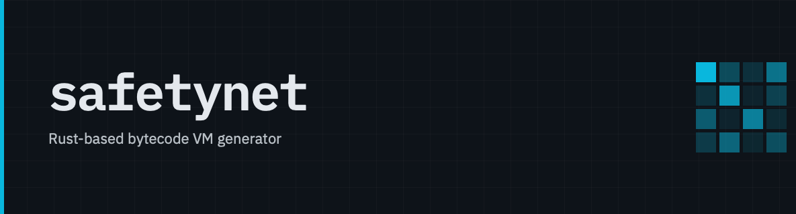

A Rust-embedded bytecode VM for reversing challenges: guest code becomes
packed bytecode over a stack machine, built entirely at compile time.

> **Status: early development.** The design is fully specified in
> [`docs/spec.md`](docs/spec.md).

## How it works

The eventual surface is a normal Rust function:

```rust
#[safetynet]
fn check(pkt: Packet) -> u32 {
    // ordinary Rust — the VM is invisible here
}
```

Expanding `#[safetynet]` produces the **replaced function** (body swapped for
*marshal → run → unmarshal*), the **embedded program** (bytecode plus memory
image, built at compile time).

## Assembling by hand: `safetynet::asm!`

Under that lowerer is a textual front-end you can use directly. It takes a byte
order and assembly with labels and named frame cells, and evaluates to an
`Artifact<Order>` — validated, laid out, and encoded at expansion time:

```rust
use safetynet::{Artifact, Le};

fn program() -> Artifact<Le> {
    safetynet::asm!(Le {
        .frame { cursor: u64 }
    entry:
        $push .input       // the input region's base — filled in at finalize
        $store cursor
        $load cursor
        halt
    })
}
```

Labels open blocks and terminators close them; cells are reached by name, so
nothing in the source is a byte offset or an address. `cargo expand` shows there
is no IR or interpreter left in the output — just finished bytecode and a
relocation for the one address the program cannot settle on its own:

```rust
fn program() -> Artifact<Le> {
    const CODE: &[u8] = &[
        5u8, 8u8, 0u8,              // alloc 8      — frame prologue
        2u8, 0u8, 0u8, 0u8, 0u8,    // push32 0     — .input base placeholder
        12u8, 16u8, 0u8,            // sts64 16     — store cursor
        9u8, 8u8, 0u8,              // lds64 8      — load cursor
        0u8,                        // halt
    ];
    ::safetynet::Artifact::<Le>::new(
        CODE,
        ::safetynet::FrameSize::new(8u16).unwrap_or_default(),
        ::std::vec![
            ::safetynet::Reloc::region_base::<Le>(3usize, ::safetynet::Region::Input),
        ],
    )
}
```

(The relocation's `vec!` is shown collapsed; nightly `cargo expand` renders that
macro's internals.) `$push .input` became a placeholder `push32 0` at byte 3,
paired with a relocation. `finalize` runs the relocations against a layout and
returns runnable bytecode; the VM executes it in the artifact's byte order:

```rust
let program = program().finalize(&layout)?;   // fills push32 with .input's base
let vm = Vm::<Le>::new(image).run(&program, fuel)?;   // result left on the stack
```

`Vm<Be>` will not run a `Program<Le>` — the byte order is part of the type.

## Supported Rust subset

Guest functions are complexity-limited: `if`/`while`/`loop`/`for a..b`,
`break`/`continue`, short-circuiting `&&`/`||`, `match`, field-less and
data-carrying enums, `Result` and `?` (single error type), and module-scoped
inlined calls. No recursion, heap, generics, traits, closures, or floats in guest
code. Out-of-subset constructs are rejected at compile time with a pointing error.

## Workspace

```
crates/
  safetynet-core     opcode table, IR types, traits, byte-order policy,
                     layout descriptors, assembler, interpreter
  safetynet-macros   proc-macros: #[safetynet], #[derive(VmLayout)], asm!
  safetynet          the façade crate downstream code depends on
  safetynet-demo     a sample challenge binary exercising the whole ISA
docs/spec.md         the full specification and design review
```
