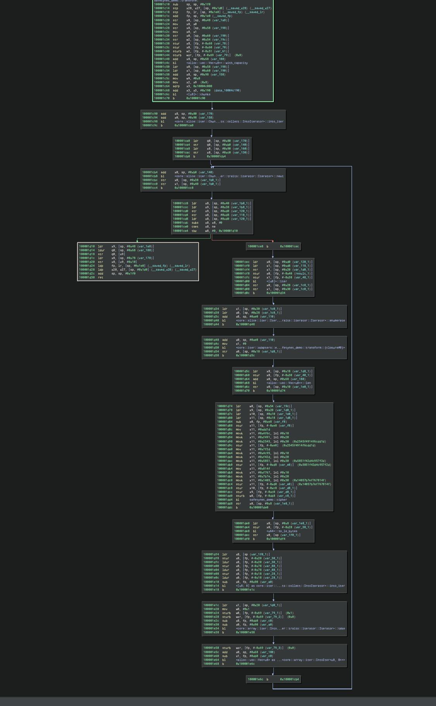
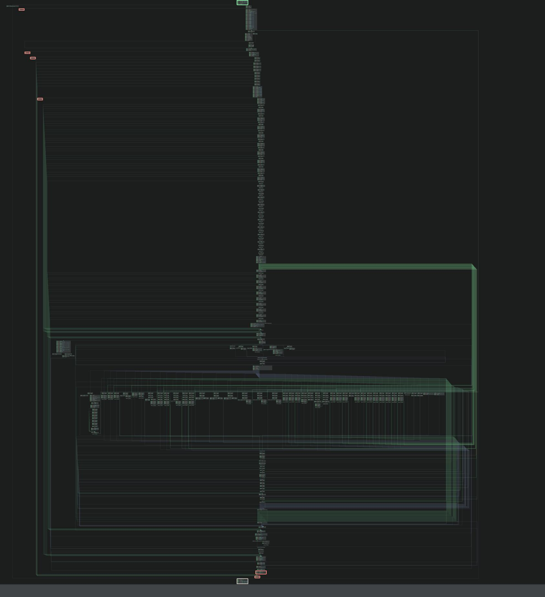

[](https://sladge.net)


A Rust-embedded bytecode VM for reversing challenges: guest code becomes
packed bytecode over a stack machine, built entirely at compile time.

> **Status: Proof of Concept.** Current work focuses on hardening and adding variety to the VM

## Why
`safetynet` is a Rust library for building reverse-engineering puzzles. 

You write an ordinary function, tag it with `#[safetynet]`, and at compile time the macro rewrites its body into bytecode for a tiny made-up CPU plus an interpreter that runs it -- so the shipped binary no longer contains recognizable machine code for your logic, just a little VM and an opaque blob someone has to decode. 

The function still behaves identically to callers, and the build validates the VM against your original Rust so the hidden version is provably equivalent to what you wrote. It's essentially a small compiler that runs entirely inside rustc.

## How it works

The surface is a normal Rust function — ordinary Rust, the VM invisible here:

```rust
#[safetynet]
fn check(pkt: Packet) -> u32 {
    // Checksum: fold the fields together and clamp the result.
    let seq: u32 = pkt.seq.typed::<u32>();
    let len: u32 = pkt.len.typed::<u32>();
    let mut acc: u32 = seq ^ (len * 2654435761);
    let mut i: u32 = 0;
    while i < len {
        acc = (acc << 1) | (acc >> 31);
        acc = acc + i;
        i = i + 1;
    }
    acc
}
```

Expanding `#[safetynet]` produces the **replaced function** and the **embedded program** (bytecode plus memory
image, built at compile time).

## Before and after

The same function, disassembled and drawn as a control-flow graph. On the left,
compiled straight to ARM64: a handful of blocks that read as what they are. On
the right, the same logic behind `#[safetynet]` — the native code is now the VM
interpreter walking an opaque bytecode blob, and the shape of the original
computation is gone.

| Native | Lowered through `#[safetynet]` |
| :---: | :---: |
|  |  |


## Supported Rust subset

Guest functions are complexity-limited. Out-of-subset constructs are rejected at
compile time with an error pointing at the offending code.

**Supported**

- Control flow: `if`, `while`, `loop`, `for a..b`, `break`, `continue`
- Short-circuiting `&&` and `||`
- `as` casts between the machine's scalars
- Byte regions: `Bytes`, `String` and `Vec<u8>` fields (or one as the whole
  parameter), walked with `for b in p.body.iter()` and measured with `.len()`
- `match`
- Enums, both field-less and data-carrying (WIP)
- `Result` and `?`, with a single error type (WIP)
- Function calls (WIP)

Struct fields carry one extra rule: a field's first use names its type with
[`Typed::typed`], and later uses may go bare. Naming two different types for
one field is a compile error.

```rust
use safetynet::Typed;

#[safetynet]
fn check(pkt: Packet) -> u32 {
    if pkt.seq.typed::<u32>() > 100 {   // first use names the type
        return 100;
    }
    pkt.seq                             // known from here on
}
```

The macro sees only the annotated function's tokens — not the struct
definition — so it cannot resolve a field's type on its own; `.typed::<u32>()`
supplies it. The call is an identity function bounded so it compiles only when
the field is *exactly* the named type: name the wrong one and rustc rejects
the hidden reference copy of your function, pointing at the call. A field used
before its type is named is refused with an error that spells out the fix.

A variable-length field crosses as a fixed eight-byte header — where its bytes
start and how many there are — with the bytes appended after the struct, so
every field offset is still a compile-time constant and the linker stays
`const`. The guest walks it the way plain Rust does; `.len()` is a `usize` to
Rust and a word to the machine, so narrow it with `as` where you need to.

```rust
use safetynet::Bytes;

#[derive(Clone, VmLayout)]
struct Msg {
    kind: u8,
    body: Bytes,
    name: String,
}

#[safetynet]
fn checksum(m: Msg) -> u32 {
    let mut s: u32 = 0;
    for b in m.body.iter() {
        s += *b as u32;
    }
    for c in m.name.bytes() {
        s ^= c as u32;
    }
    s + m.body.len() as u32
}
```

## Workspace

```
crates/
  safetynet-core     opcode table, IR types, traits, byte-order policy,
                     layout descriptors, interpreter
  safetynet-macros   proc-macros: #[safetynet], #[derive(VmLayout)]
  safetynet          the façade crate downstream code depends on
  safetynet-demo     a sample cipher lowered from Rust with #[safetynet]
docs/spec.md         the full specification and design review
```
## The `debug` feature

Off by default. Without it the runtime carries no human-readable text at all:
error types display nothing, `Debug` writes nothing, there is no IR listing and
no instruction mnemonic, and a failing wrapper panics with the single word
`safetynet`. Turn it on to see why something failed:

```toml
[dependencies]
safetynet = { version = "0.1", features = ["debug"] }
```

The feature also covers the compiler: `SN_DUMP_IR=1` prints a listing and an
assembler error names its reason only with `debug` on. Errors about the Rust
subset itself are always spelled out. CI builds the demo without the feature
and fails if any diagnostic text turns up in the binary.

**Not supported**

- Recursion
- Heap allocation
- Generics, traits, closures
- Floats
